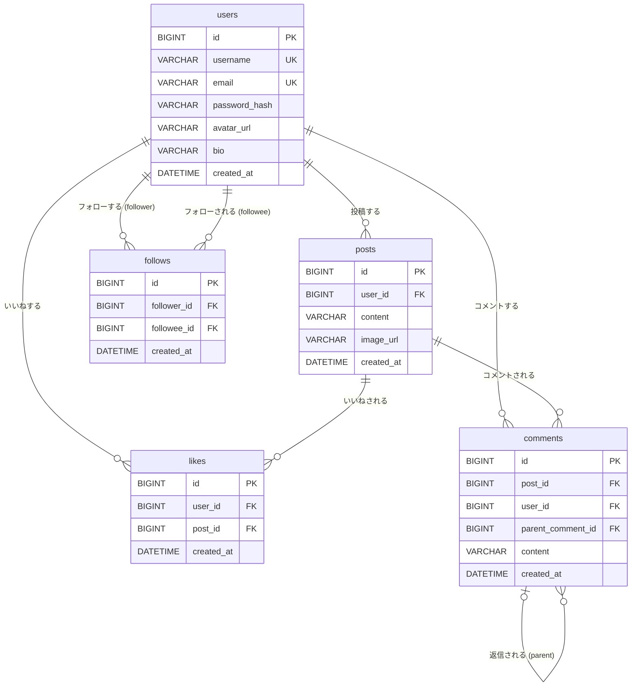

# データベース設計書

**プロジェクト:** WiZUs
**作成日:** 2026-07-11
**DB:** MySQL 8.0 (Amazon RDS)

---

## 1. テーブル一覧

| テーブル名 | 概要 |
|-----------|------|
| users | ユーザー情報 |
| posts | 投稿 |
| likes | いいね（users と posts の中間テーブル） |
| comments | コメント・返信（自己参照） |
| follows | フォロー関係（users の自己参照中間テーブル） |

---

## 2. ER 図



---

## 3. テーブル定義

### users

| カラム名 | 型 | 制約 | 説明 |
|---------|-----|------|------|
| id | BIGINT | PK, AUTO_INCREMENT | |
| username | VARCHAR(50) | UNIQUE, NOT NULL | 表示名 |
| email | VARCHAR(255) | UNIQUE, NOT NULL | ログイン用 |
| password_hash | VARCHAR(255) | NOT NULL | BCrypt ハッシュ |
| avatar_url | VARCHAR(500) | NULL | S3 オブジェクト URL |
| bio | VARCHAR(160) | NULL | 自己紹介文 |
| created_at | DATETIME | NOT NULL | |

**インデックス:**
- PK: `id`
- UNIQUE: `email`, `username`

---

### posts

| カラム名 | 型 | 制約 | 説明 |
|---------|-----|------|------|
| id | BIGINT | PK, AUTO_INCREMENT | |
| user_id | BIGINT | FK → users.id, NOT NULL | 投稿者 |
| content | VARCHAR(280) | NOT NULL | 本文 |
| image_url | VARCHAR(500) | NULL | S3 オブジェクト URL |
| created_at | DATETIME | NOT NULL | |

**インデックス:**
- PK: `id`
- INDEX: `user_id` (ユーザー別投稿一覧)
- INDEX: `created_at DESC` (タイムライン新着順)

**外部キー:**
- `user_id` → `users.id` ON DELETE CASCADE

---

### likes

| カラム名 | 型 | 制約 | 説明 |
|---------|-----|------|------|
| id | BIGINT | PK, AUTO_INCREMENT | |
| user_id | BIGINT | FK → users.id, NOT NULL | いいねしたユーザー |
| post_id | BIGINT | FK → posts.id, NOT NULL | いいねされた投稿 |
| created_at | DATETIME | NOT NULL | |

**インデックス:**
- PK: `id`
- UNIQUE: `(user_id, post_id)` ← 同一ユーザーの二重いいね防止

**外部キー:**
- `user_id` → `users.id` ON DELETE CASCADE
- `post_id` → `posts.id` ON DELETE CASCADE

---

### comments

| カラム名 | 型 | 制約 | 説明 |
|---------|-----|------|------|
| id | BIGINT | PK, AUTO_INCREMENT | |
| post_id | BIGINT | FK → posts.id, NOT NULL | 対象投稿 |
| user_id | BIGINT | FK → users.id, NOT NULL | コメント投稿者 |
| parent_comment_id | BIGINT | FK → comments.id, NULL | 返信の場合に親コメント ID を設定 |
| content | VARCHAR(280) | NOT NULL | 本文 |
| created_at | DATETIME | NOT NULL | |

**インデックス:**
- PK: `id`
- INDEX: `post_id` (投稿別コメント一覧)
- INDEX: `parent_comment_id` (返信取得)

**外部キー:**
- `post_id` → `posts.id` ON DELETE CASCADE
- `user_id` → `users.id` ON DELETE CASCADE
- `parent_comment_id` → `comments.id` ON DELETE CASCADE

**備考:** `parent_comment_id IS NULL` がトップレベルコメント、`NOT NULL` が返信。返信への返信は禁止（アプリ層で制御）。

---

### follows

| カラム名 | 型 | 制約 | 説明 |
|---------|-----|------|------|
| id | BIGINT | PK, AUTO_INCREMENT | |
| follower_id | BIGINT | FK → users.id, NOT NULL | フォローする側 |
| followee_id | BIGINT | FK → users.id, NOT NULL | フォローされる側 |
| created_at | DATETIME | NOT NULL | |

**インデックス:**
- PK: `id`
- UNIQUE: `(follower_id, followee_id)` ← 二重フォロー防止
- INDEX: `follower_id` (フォロー中一覧)
- INDEX: `followee_id` (フォロワー一覧)

**外部キー:**
- `follower_id` → `users.id` ON DELETE CASCADE
- `followee_id` → `users.id` ON DELETE CASCADE

---

## 4. DDL（参考）

```sql
CREATE DATABASE sns_db CHARACTER SET utf8mb4 COLLATE utf8mb4_unicode_ci;
USE sns_db;

CREATE TABLE users (
  id            BIGINT       NOT NULL AUTO_INCREMENT,
  username      VARCHAR(50)  NOT NULL,
  email         VARCHAR(255) NOT NULL,
  password_hash VARCHAR(255) NOT NULL,
  avatar_url    VARCHAR(500),
  bio           VARCHAR(160),
  created_at    DATETIME     NOT NULL,
  PRIMARY KEY (id),
  UNIQUE KEY uk_users_email    (email),
  UNIQUE KEY uk_users_username (username)
);

CREATE TABLE posts (
  id         BIGINT       NOT NULL AUTO_INCREMENT,
  user_id    BIGINT       NOT NULL,
  content    VARCHAR(280) NOT NULL,
  image_url  VARCHAR(500),
  created_at DATETIME     NOT NULL,
  PRIMARY KEY (id),
  KEY idx_posts_user_id    (user_id),
  KEY idx_posts_created_at (created_at),
  CONSTRAINT fk_posts_user FOREIGN KEY (user_id) REFERENCES users (id) ON DELETE CASCADE
);

CREATE TABLE likes (
  id         BIGINT   NOT NULL AUTO_INCREMENT,
  user_id    BIGINT   NOT NULL,
  post_id    BIGINT   NOT NULL,
  created_at DATETIME NOT NULL,
  PRIMARY KEY (id),
  UNIQUE KEY uk_likes (user_id, post_id),
  CONSTRAINT fk_likes_user FOREIGN KEY (user_id) REFERENCES users (id) ON DELETE CASCADE,
  CONSTRAINT fk_likes_post FOREIGN KEY (post_id) REFERENCES posts (id) ON DELETE CASCADE
);

CREATE TABLE comments (
  id                BIGINT       NOT NULL AUTO_INCREMENT,
  post_id           BIGINT       NOT NULL,
  user_id           BIGINT       NOT NULL,
  parent_comment_id BIGINT,
  content           VARCHAR(280) NOT NULL,
  created_at        DATETIME     NOT NULL,
  PRIMARY KEY (id),
  KEY idx_comments_post_id   (post_id),
  KEY idx_comments_parent_id (parent_comment_id),
  CONSTRAINT fk_comments_post   FOREIGN KEY (post_id)           REFERENCES posts    (id) ON DELETE CASCADE,
  CONSTRAINT fk_comments_user   FOREIGN KEY (user_id)           REFERENCES users    (id) ON DELETE CASCADE,
  CONSTRAINT fk_comments_parent FOREIGN KEY (parent_comment_id) REFERENCES comments (id) ON DELETE CASCADE
);

CREATE TABLE follows (
  id          BIGINT   NOT NULL AUTO_INCREMENT,
  follower_id BIGINT   NOT NULL,
  followee_id BIGINT   NOT NULL,
  created_at  DATETIME NOT NULL,
  PRIMARY KEY (id),
  UNIQUE KEY uk_follows (follower_id, followee_id),
  KEY idx_follows_follower (follower_id),
  KEY idx_follows_followee (followee_id),
  CONSTRAINT fk_follows_follower FOREIGN KEY (follower_id) REFERENCES users (id) ON DELETE CASCADE,
  CONSTRAINT fk_follows_followee FOREIGN KEY (followee_id) REFERENCES users (id) ON DELETE CASCADE
);
```
